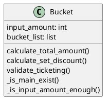

## テスト

### クラス図

```plantuml
@startuml

' class "TicketMachine" as TicketMachine {
'     bucket: Bucket
'     show_is_ticketing()
' }

class "Bucket" as Bucket {
    input_amount: int
    bucket_list: list

    calculate_total_amount() 
    calculate_set_discount()
    validate_ticketing()
    _is_main_exist() 
    _is_input_amount_enough()
}


@enduml
```

### シーケンス図