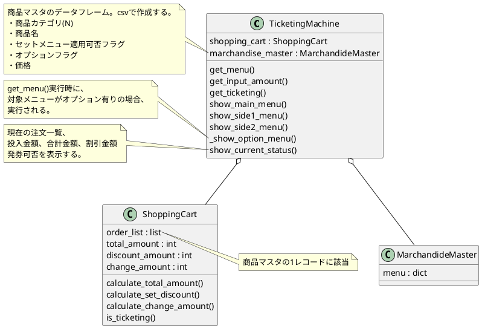

## 応用情報技術者過去問題 平成31年春期 午後問3

### 独自仕様
- イベントコードと状態番号のコンソール出力は行わない（ユーザーにとって不要な情報であるため）
- エラークラスの設計と実装はTBD

### クラス図

```plantuml
@startuml
TicketingMachine o-- ShoppingCart
TicketingMachine o-- MarchandideMaster

class TicketingMachine {
    shopping_cart : ShoppingCart
    marchandise_master : MarchandideMaster
    get_menu()
    get_input_amount()
    get_ticketing()
    show_main_menu()
    show_side1_menu()
    show_side2_menu()
    _show_option_menu()
    show_current_status()
}

note left of TicketingMachine::marchandise_master
    商品マスタのデータフレーム。csvで作成する。
    ・商品カテゴリ(N)
    ・商品名
    ・セットメニュー適用可否フラグ
    ・オプションフラグ
    ・価格
endnote

note left of TicketingMachine::_show_option_menu()
    get_menu()実行時に、
    対象メニューがオプション有りの場合、
    実行される。
endnote

note left of TicketingMachine::show_current_status()
    現在の注文一覧、
    投入金額、合計金額、割引金額
    発券可否を表示する。
endnote

class ShoppingCart {
    order_list : list
    total_amount : int
    discount_amount : int
    change_amount : int
    calculate_total_amount()
    calculate_set_discount()
    calculate_change_amount()
    is_ticketing()
}

note right of ShoppingCart::order_list
    商品マスタの1レコードに該当
endnote

class MarchandideMaster {
    menu : dict
}


@enduml
```

### シーケンス図