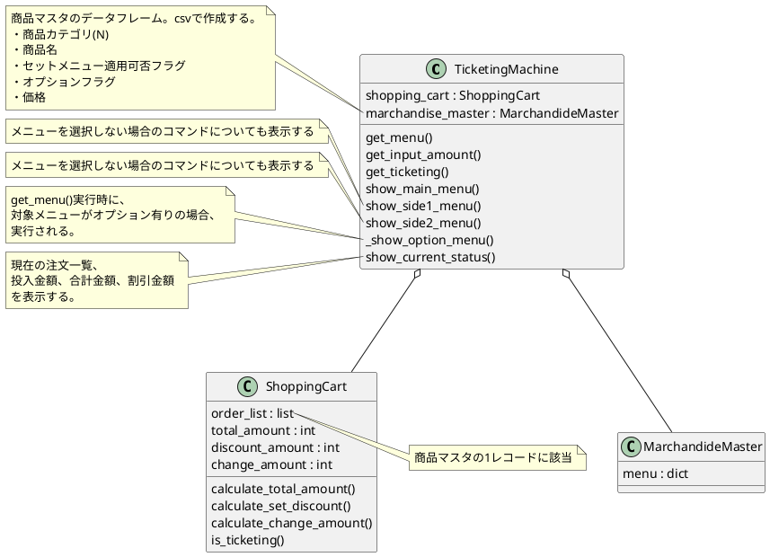

## 応用情報技術者過去問題 平成31年春期 午後問3

### 独自仕様
- イベントコードと状態番号のコンソール出力は行わない（ユーザーにとって不要な情報であるため）
- エラークラスの設計と実装はTBD
- メインメニュー受付 -> サイドメニュー1受付 -> サイドメニュー2受付 というフローで処理する（問題文の状態遷移図とは処理フローが異なる）

#### 反省点

#### TODO 
- 問題文と仕様が異なっているので、問題文と同等の仕様でチャレンジしていみたい。

#### メモ
- MarchandiseMasterは、本当のシステムならDBになる部分
- 標準出力のシーケンスの書き方がわからない。これであってるのか。

### クラス図

### シーケンス図

```plantuml
@startuml
actor User
control Main
participant TicketingMachine
participant MarchandiseMaster
participant ShoppingCart

User -> Main : Execute source
activate Main

Main -> MarchandideMaster
activate MarchandideMaster
MarchandideMaster --> Main : marchandise_master(MarchandideMaster)
deactivate MarchandideMaster

Main -> ShoppingCart
activate ShoppingCart
ShoppingCart --> Main : shopping_cart(ShoppingCart)
deactivate ShoppingCart

Main -> TicketingMachine : marchandise_master(MarchandideMaster)\nshopping_cart(ShoppingCart)
activate TicketingMachine
TicketingMachine --> Main : ticketing_machine(TicketingMachine)
deactivate TicketingMachine


' メインメニューの選択
note over Main : メインメニューの選択

Main -> ShoppingCart : calculate_total_amount()
activate ShoppingCart
ShoppingCart --> Main : total_amount[int]
deactivate ShoppingCart

Main -> ShoppingCart : calculate_set_discount()
activate ShoppingCart
ShoppingCart --> Main : discount_amount[int]
deactivate ShoppingCart

Main -> ShoppingCart : is_ticketing
activate ShoppingCart
ShoppingCart --> Main : ticketing_flag[bool]
deactivate ShoppingCart

Main -> TicketingMachine : show_current_status()
activate TicketingMachine
TicketingMachine -> User : 現在の注文一覧を表示
deactivate TicketingMachine

Main -> TicketingMachine : show_main_menu()
activate TicketingMachine
TicketingMachine -> User : メインメニュー一覧を表示
deactivate TicketingMachine

Main -> TicketingMachine : get_menu("Main")
activate TicketingMachine
TicketingMachine -> User : メニュー選択指示
User --> TicketingMachine : menu_code（int）

opt オプション有り
    TicketingMachine -> TicketingMachine : _show_option_menu()
    activate TicketingMachine
    TicketingMachine -> User : オプションメニュー一覧を表示
    deactivate TicketingMachine

    TicketingMachine -> TicketingMachine : get_menu("Option")
    activate TicketingMachine
    TicketingMachine -> User : メニュー選択指示
    User --> TicketingMachine : menu_code (int)
    deactivate TicketingMachine
end

deactivate TicketingMachine

' サイドメニュー1の選択
note over Main : サイドメニュー1の選択
loop 
    Main -> ShoppingCart : calculate_total_amount()
    activate ShoppingCart
    ShoppingCart --> Main : total_amount[int]
    deactivate ShoppingCart

    Main -> ShoppingCart : calculate_set_discount()
    activate ShoppingCart
    ShoppingCart --> Main : discount_amount[int]
    deactivate ShoppingCart

    Main -> ShoppingCart : is_ticketing
    activate ShoppingCart
    ShoppingCart --> Main : ticketing_flag[bool]
    deactivate ShoppingCart

    Main -> TicketingMachine : show_current_status()
    activate TicketingMachine
    TicketingMachine -> User : 現在の注文一覧を表示
    deactivate TicketingMachine

    Main -> TicketingMachine : show_side1_menu()
    activate TicketingMachine
    TicketingMachine -> User : サイドメニュー1一覧を表示
    deactivate TicketingMachine

    Main -> TicketingMachine : get_menu("Side1")
    activate TicketingMachine
    TicketingMachine -> User : メニュー選択指示
    User --> TicketingMachine : menu_code（int）

    break サイドメニュー1を選択しない
        TicketingMachine --> Main : ループ終了
    end
    
    opt オプション有り
        TicketingMachine -> TicketingMachine : _show_option_menu()
        activate TicketingMachine
        TicketingMachine -> User : オプションメニュー一覧を表示
        deactivate TicketingMachine

        TicketingMachine -> TicketingMachine : get_menu("Option")
        activate TicketingMachine
        TicketingMachine -> User : メニュー選択指示
        User --> TicketingMachine : menu_code (int)
        deactivate TicketingMachine
    end
end

deactivate TicketingMachine

' サイドメニュー2の選択
note over Main : サイドメニュー2の選択
loop 
    Main -> ShoppingCart : calculate_total_amount()
    activate ShoppingCart
    ShoppingCart --> Main : total_amount[int]
    deactivate ShoppingCart

    Main -> ShoppingCart : calculate_set_discount()
    activate ShoppingCart
    ShoppingCart --> Main : discount_amount[int]
    deactivate ShoppingCart

    Main -> ShoppingCart : is_ticketing
    activate ShoppingCart
    ShoppingCart --> Main : ticketing_flag[bool]
    deactivate ShoppingCart

    Main -> TicketingMachine : show_current_status()
    activate TicketingMachine
    TicketingMachine -> User : 現在の注文一覧を表示
    deactivate TicketingMachine

    Main -> TicketingMachine : show_side2_menu()
    activate TicketingMachine
    TicketingMachine -> User : サイドメニュー1一覧を表示
    deactivate TicketingMachine

    Main -> TicketingMachine : get_menu("Side2")
    activate TicketingMachine
    TicketingMachine -> User : メニュー選択指示
    User --> TicketingMachine : menu_code（int）

    break サイドメニュー1を選択しない
        TicketingMachine --> Main : ループ終了
    end

    opt オプション有り
        TicketingMachine -> TicketingMachine : _show_option_menu()
        activate TicketingMachine
        TicketingMachine -> User : オプションメニュー一覧を表示
        deactivate TicketingMachine

        TicketingMachine -> TicketingMachine : get_menu("Option")
        activate TicketingMachine
        TicketingMachine -> User : メニュー選択指示
        User --> TicketingMachine : menu_code (int)
        deactivate TicketingMachine
    end
end

deactivate TicketingMachine

' 支払い
note over Main : 支払い
loop
    Main -> TicketingMachine : show_current_status()
    activate TicketingMachine
    TicketingMachine -> User : 現在の注文一覧を表示
    deactivate TicketingMachine

    Main -> TicketingMachine : get_input_amount()
    activate TicketingMachine
    break calculate_change_amount() >= 0
        TicketingMachine --> Main : ループ終了
    end
    deactivate TicketingMachine
end

    Main -> TicketingMachine : get_ticketing()
    activate TicketingMachine
    TicketingMachine --> User : 発券メッセージ
    deactivate TicketingMachine





@enduml
```

