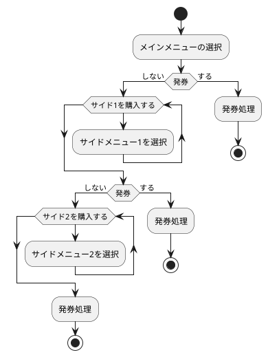
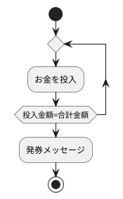
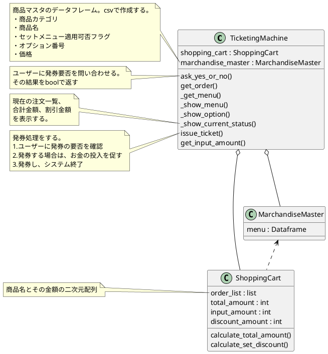
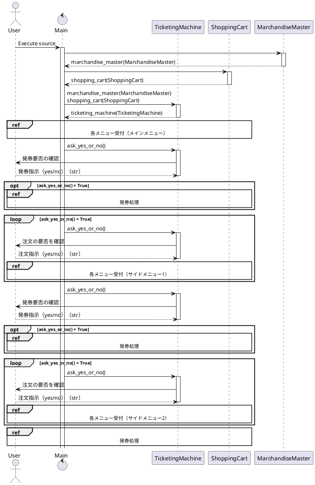
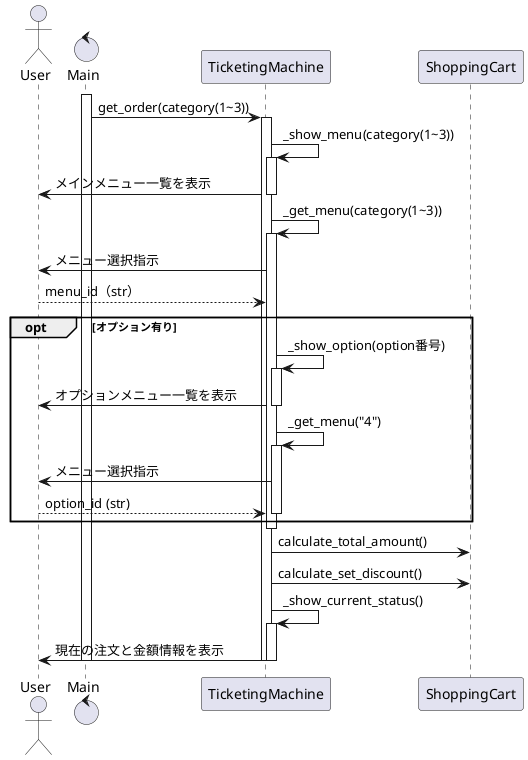
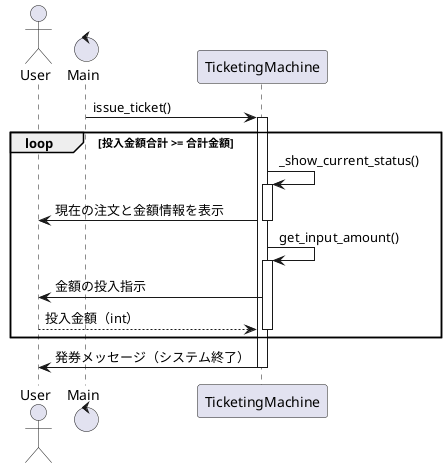

## 応用情報技術者過去問題 平成31年春期 午後問3

### 目次
1. [メモ](#memo)
2. [アクティビティ図](#activity)
3. [クラス図](#class)
4. [シーケンス図（全体）](#sequence-whole)
5. [シーケンス図（メインメニュー）](#sequence-menu)
6. [シーケンス図（発券処理）](#sequence-ticketing)

### メモ
- イベントコードと状態番号のコンソール出力は行わない（ユーザーにとって不要な情報であるため）
- エラークラスの設計と実装はTBD
- 発券可能条件
    - メイン商品が一つ選択されていること
    - オプション商品が選択されていること

### アクティビティ図
#### システム全体のフロー

#### 発券処理のフロー

### クラス図

### シーケンス図（全体）

### シーケンス図（各メニュー受付）

### シーケンス図（発券処理）
