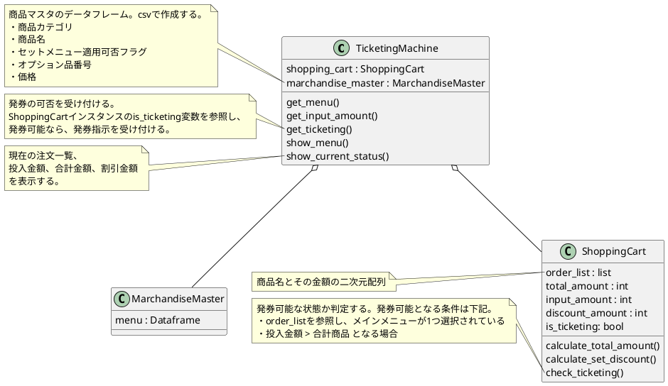
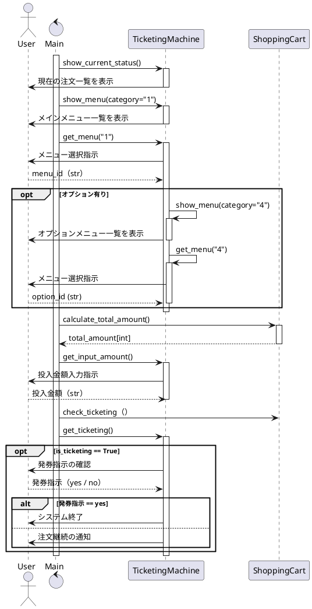

## 応用情報技術者過去問題 平成31年春期 午後問3

### 目次
1. [独自仕様](#original)
2. [反省点](#reflections)
3. [TOD0](#todo)
4. [メモ](#memo)
5. [クラス図](#class)
6. [シーケンス図（全体）](#sequence-whole)
7. [シーケンス図（メインメニュー）](#sequence-main)

### 独自仕様
- イベントコードと状態番号のコンソール出力は行わない（ユーザーにとって不要な情報であるため）
- エラークラスの設計と実装はTBD
- メインメニュー受付 -> サイドメニュー1受付 -> サイドメニュー2受付 というフローで処理する（問題文の状態遷移図とは処理フローが異なる）

#### 反省点

#### TODO 
- 問題文と仕様が異なっているので、問題文と同等の仕様でチャレンジしていみたい。

#### メモ
- MarchandiseMasterは、本当のシステムならDBになる部分
- 標準出力のシーケンスの書き方がわからない。これであってるのか。

### クラス図

### シーケンス図（全体）

```plantuml
@startuml
actor User
control Main
participant TicketingMachine
participant ShoppingCart
participant MarchandiseMaster

User -> Main : Execute source
activate Main

Main -> MarchandiseMaster
activate MarchandiseMaster
MarchandiseMaster --> Main : marchandise_master(MarchandiseMaster)
deactivate MarchandiseMaster

Main -> ShoppingCart
activate ShoppingCart
ShoppingCart --> Main : shopping_cart(ShoppingCart)
deactivate ShoppingCart

Main -> TicketingMachine : marchandise_master(MarchandiseMaster)\nshopping_cart(ShoppingCart)
activate TicketingMachine
TicketingMachine --> Main : ticketing_machine(TicketingMachine)
deactivate TicketingMachine


' メインメニューの選択

ref over User, Main, TicketingMachine, ShoppingCart
    メインメニューの選択
end ref


' サイドメニュー1の選択
note over Main : サイドメニュー1の選択
loop 
    Main -> ShoppingCart : calculate_total_amount()
    activate ShoppingCart
    ShoppingCart --> Main : total_amount[int]
    deactivate ShoppingCart

    Main -> ShoppingCart : calculate_set_discount()
    activate ShoppingCart
    ShoppingCart --> Main : discount_amount[int]
    deactivate ShoppingCart

    Main -> ShoppingCart : is_ticketing
    activate ShoppingCart
    ShoppingCart --> Main : ticketing_flag[bool]
    deactivate ShoppingCart

    Main -> TicketingMachine : show_current_status()
    activate TicketingMachine
    TicketingMachine -> User : 現在の注文一覧を表示
    deactivate TicketingMachine

    Main -> TicketingMachine : show_menu(category="2")
    activate TicketingMachine
    TicketingMachine -> User : サイドメニュー1一覧を表示
    deactivate TicketingMachine

    Main -> TicketingMachine : get_menu("2")
    activate TicketingMachine
    TicketingMachine -> User : メニュー選択指示
    User --> TicketingMachine : menu_id（int）

    break サイドメニュー1を選択しない
        TicketingMachine --> Main : ループ終了
    end
    
    opt オプション有り
        TicketingMachine -> TicketingMachine : show_menu(category="4")
        activate TicketingMachine
        TicketingMachine -> User : オプションメニュー一覧を表示
        deactivate TicketingMachine

        TicketingMachine -> TicketingMachine : get_menu("4")
        activate TicketingMachine
        TicketingMachine -> User : メニュー選択指示
        User --> TicketingMachine : option_id (int)
        deactivate TicketingMachine
    end
end

deactivate TicketingMachine

' サイドメニュー2の選択
note over Main : サイドメニュー2の選択
loop 
    Main -> ShoppingCart : calculate_total_amount()
    activate ShoppingCart
    ShoppingCart --> Main : total_amount[int]
    deactivate ShoppingCart

    Main -> ShoppingCart : calculate_set_discount()
    activate ShoppingCart
    ShoppingCart --> Main : discount_amount[int]
    deactivate ShoppingCart

    Main -> ShoppingCart : is_ticketing
    activate ShoppingCart
    ShoppingCart --> Main : ticketing_flag[bool]
    deactivate ShoppingCart

    Main -> TicketingMachine : show_current_status()
    activate TicketingMachine
    TicketingMachine -> User : 現在の注文一覧を表示
    deactivate TicketingMachine

    Main -> TicketingMachine : show_menu(category="2")
    activate TicketingMachine
    TicketingMachine -> User : サイドメニュー1一覧を表示
    deactivate TicketingMachine

    Main -> TicketingMachine : get_menu("3")
    activate TicketingMachine
    TicketingMachine -> User : メニュー選択指示
    User --> TicketingMachine : menu_id（int）

    break サイドメニュー1を選択しない
        TicketingMachine --> Main : ループ終了
    end

    opt オプション有り
        TicketingMachine -> TicketingMachine : show_menu(category="4")
        activate TicketingMachine
        TicketingMachine -> User : オプションメニュー一覧を表示
        deactivate TicketingMachine

        TicketingMachine -> TicketingMachine : get_menu("4")
        activate TicketingMachine
        TicketingMachine -> User : メニュー選択指示
        User --> TicketingMachine : option_id (int)
        deactivate TicketingMachine
    end
end

deactivate TicketingMachine

' 支払い
note over Main : 支払い
loop
    Main -> TicketingMachine : show_current_status()
    activate TicketingMachine
    TicketingMachine -> User : 現在の注文一覧を表示
    deactivate TicketingMachine

    Main -> TicketingMachine : get_input_amount()
    activate TicketingMachine
    break calculate_change_amount() >= 0
        TicketingMachine --> Main : ループ終了
    end
    deactivate TicketingMachine
end

    Main -> TicketingMachine : get_ticketing()
    activate TicketingMachine
    TicketingMachine --> User : 発券メッセージ
    deactivate TicketingMachine

@enduml
```

### シーケンス図（メインメニュー受付）
