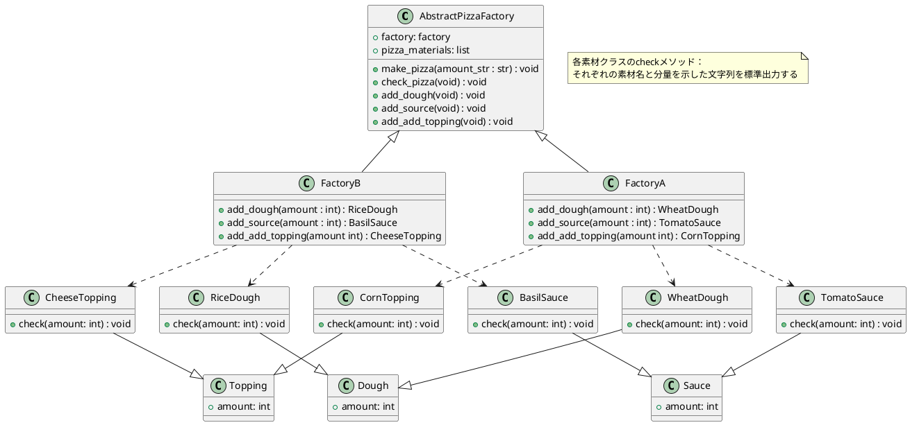
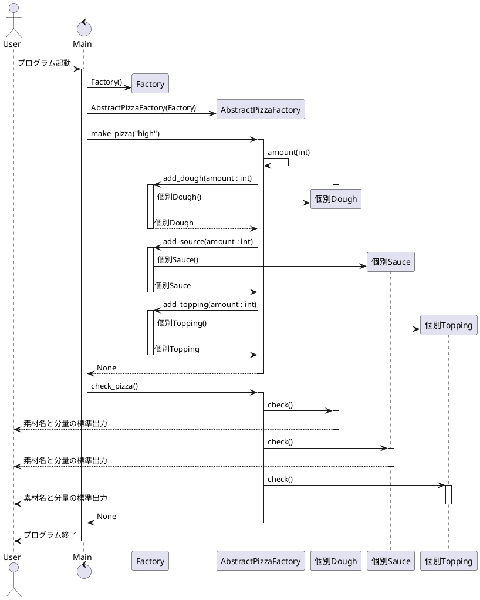

## メモ
新規種類のピザを作成したくなった場合、容易に設計変更をすることができる

## このプログラムについて
本プログラムは、全種類のピザのオブジェクトを作成し、
それぞれのピザの素材と分量を標準出力するものである。

## クラス図

## シーケンス図
個別Dough：WheatDough、RiceDough
個別Sauce：TomatoSauce、BasilSauce
個別Topping：CornTopping、CheeseTopping
Factory：FactoryA, FactoryB
を示す。
