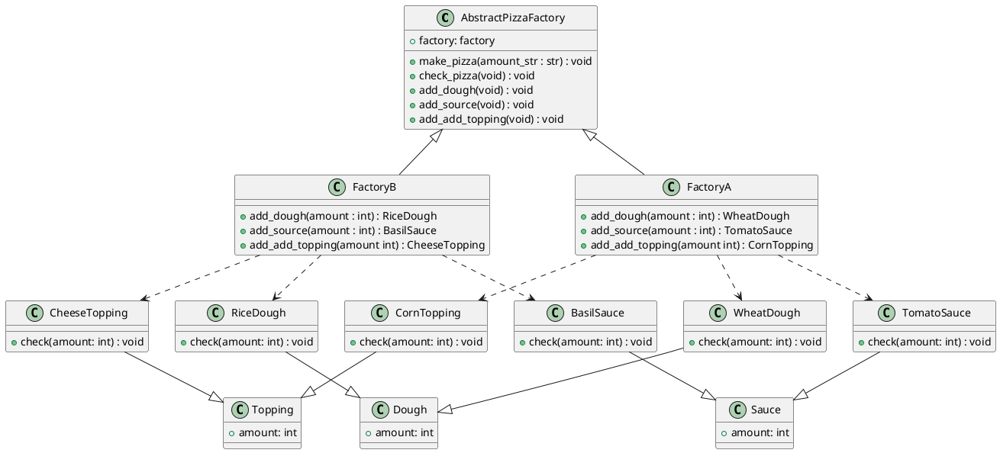

## メモ
AでもBでもない、異なる種類のピザを作りたくなった時、新規でFactoryクラスを作成する

## クラス図

```plantuml
@startuml

AbstractPizzaFactory <|-- FactoryA
AbstractPizzaFactory <|-- FactoryB

Dough <|-up- WheatDough
Dough <|-up- RiceDough

Sauce <|-up- TomatoSauce
Sauce <|-up- BasilSauce

Topping <|-up- CornTopping
Topping <|-up- CheeseTopping

WheatDough <.up. FactoryA
TomatoSauce <.up. FactoryA
CornTopping <.up. FactoryA

RiceDough <.up. FactoryB
BasilSauce <.up. FactoryB
CheeseTopping <.up. FactoryB


class AbstractPizzaFactory {
    + factory: factory
    + make_pizza(amount_str : str) : void
    + check_pizza(void) : void
    + add_dough(void) : void
    + add_source(void) : void
    + add_add_topping(void) : void
}


class FactoryA {
    + add_dough(amount : int) : WheatDough
    + add_source(amount : int) : TomatoSauce
    + add_add_topping(amount int) : CornTopping
}

class FactoryB {
    + add_dough(amount : int) : RiceDough
    + add_source(amount : int) : BasilSauce
    + add_add_topping(amount int) : CheeseTopping
}

class Dough {
    + amount: int
}

class WheatDough {
    + check(amount: int) : void
}

class RiceDough {
    + check(amount: int) : void
}

class Sauce {
    + amount: int
}

class TomatoSauce {
    + check(amount: int) : void
}

class BasilSauce {
    + check(amount: int) : void
}

class Topping {
    + amount: int
}

class CornTopping {
    + check(amount: int) : void
}

class CheeseTopping {
    + check(amount: int) : void
}

@enduml
```

## シーケンス図