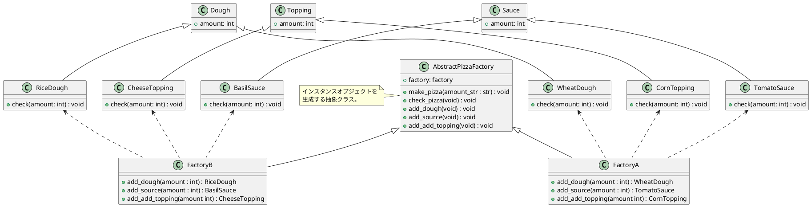

```plantuml
@startuml

AbstractPizzaFactory <|-- FactoryA
AbstractPizzaFactory <|-- FactoryB

Dough <|-- WheatDough
Dough <|-- RiceDough

Sauce <|-- TomatoSauce
Sauce <|-- BasilSauce

Topping <|-- CornTopping
Topping <|-- CheeseTopping

WheatDough <.. FactoryA
TomatoSauce <.. FactoryA
CornTopping <.. FactoryA

RiceDough <.. FactoryB
BasilSauce <.. FactoryB
CheeseTopping <.. FactoryB


class AbstractPizzaFactory {
    + factory: factory
    + make_pizza(amount_str : str) : void
    + check_pizza(void) : void
    + add_dough(void) : void
    + add_source(void) : void
    + add_add_topping(void) : void
}

note left of AbstractPizzaFactory
    インスタンスオブジェクトを
    生成する抽象クラス。
end note

class FactoryA {
    + add_dough(amount : int) : WheatDough
    + add_source(amount : int) : TomatoSauce
    + add_add_topping(amount int) : CornTopping
}

class FactoryB {
    + add_dough(amount : int) : RiceDough
    + add_source(amount : int) : BasilSauce
    + add_add_topping(amount int) : CheeseTopping
}

class Dough {
    + amount: int
}

class WheatDough {
    + check(amount: int) : void
}

class RiceDough {
    + check(amount: int) : void
}

class Sauce {
    + amount: int
}

class TomatoSauce {
    + check(amount: int) : void
}

class BasilSauce {
    + check(amount: int) : void
}

class Topping {
    + amount: int
}

class CornTopping {
    + check(amount: int) : void
}

class CheeseTopping {
    + check(amount: int) : void
}

@enduml
```